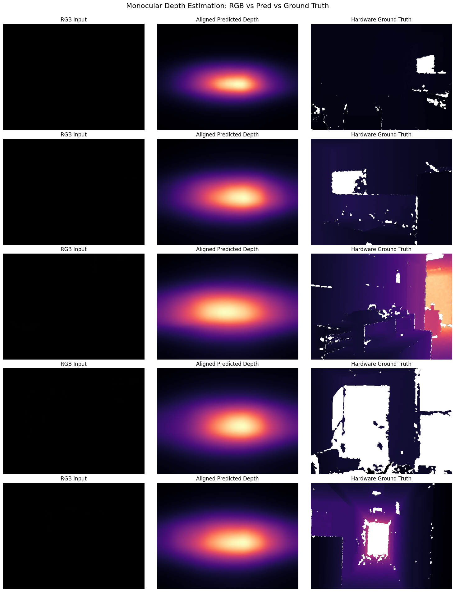
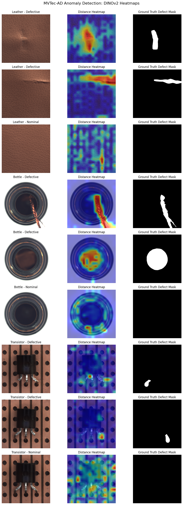

# Visual Context Foundation Models: Monocular Depth Estimation & Zero-Shot Anomaly Detection

This repository explores the practical deployment of state-of-the-art vision foundation models for downstream tasks without explicit supervised fine-tuning. The project is split into two major computer vision tracks:
1. **Monocular Depth Estimation** using `Depth-Anything-V2-Small` on the NYU-Depth-v2 dataset.
2. **Unsupervised Zero-Shot Anomaly Detection** using frozen `DINOv2-Small` patch embeddings on the MVTec-AD industrial dataset.

---

## 🌍 Real-World Applications

### 1. Monocular Depth Estimation (`Depth-Anything-V2`)

* **Autonomous Driving & Robotics:** Serves as a fast, software-based alternative or redundant safety layer for expensive LiDAR sensors, assisting in real-time collision avoidance and obstacle distance estimation.
* **Augmented Reality (AR) & VR:** Enables instant 3D room mesh generation and depth occlusions on devices with standard RGB cameras, allowing virtual objects to blend realistically behind physical barriers.
* **Computational Photography:** Powers advanced smartphone portrait modes (bokeh/blur effects) and automated 3D image mapping by generating continuous, edge-accurate depth maps instantly.

### 2. Unsupervised Anomaly Detection (`DINOv2`)

* **Industrial Quality Control:** Automates manufacturing lines (textiles, consumer goods, semiconductors) to catch rare surface defects. Because the system requires *zero defect labels* to initialize, factories can deploy it immediately using only images of "perfect" products.
* **Infrastructure Monitoring:** Automatically analyzes drone or robotic footage of pipelines, bridges, or wind turbines to spot structural cracks, anomalies, or corrosion without manual screening.
* **Medical Diagnostic Assistance:** Flags rare anomalous patterns in X-rays, MRIs, or CT scans. It acts as a zero-shot triage tool, alerting radiologists to unusual tissue structures even when training data for that specific rare condition doesn't exist.


## 🛠️ Technical Implementation & Workflow

### 1. Monocular Depth Estimation (NYU-Depth-v2)
Monocular depth models predict distance from a single 2D image. Because 2D views lack explicit physical scale context, these models suffer from scale ambiguity. To evaluate them against true hardware sensor data, we apply **median scale alignment** to align unitless predictions with real-world physical values. 

#### Core Code Block: Scaled Inverse Depth Evaluation
```python
# Extracting predictions and resolving scale alignment
with torch.no_grad():
    outputs = depth_model(**inputs)

# Depth-Anything outputs inverse depth (disparity); we interpolate and invert it
predicted_inverse_depth = outputs.predicted_depth.unsqueeze(1)
upsampled_pred_inv = F.interpolate(
    predicted_inverse_depth,
    size=gt_depth.shape,
    mode="bicubic",
    align_corners=False
).squeeze().cpu().numpy()

# Convert inverse depth to metric-relative actual depth
pred_depth_np = 1.0 / (upsampled_pred_inv + 1e-8)

# Calculate error metric strictly on valid hardware sensor regions
valid_mask = gt_depth > 0
gt_valid = gt_depth[valid_mask]
pred_valid = pred_depth_np[valid_mask]

# Apply median scale alignment
s = np.median(gt_valid) / (np.median(pred_valid) + 1e-8)
aligned_pred_valid = pred_valid * s

# Relative Error
abs_rel = np.mean(np.abs(aligned_pred_valid - gt_valid) / gt_valid)

```

#### Execution Logs & Metrics

* **Computation Device:** CUDA (`Tesla T4` / Cloud GPU)
* **Dataset Split Used:** 100 validation images
* **Total Inference Time:** 2.3627 seconds
* **Runtime Per Image:** 0.0236 seconds (Highly optimized for real-time tracking)
* **Mean Absolute Relative Error (AbsRel):** 1.4624

#### Visual Output Analysis




* **Observation:** The visualization highlights a stark contrast between predictions and raw physical data. While the hardware sensor map contains heavy visual "holes" (rendered as empty black areas) due to sensor boundaries or reflections, the foundation model constructs a continuous, structurally smooth, dense depth representation across the entire grid layout.

---

### 2. Unsupervised Anomaly Detection (MVTec-AD)

Industrial defect detection typically suffers from a extreme lack of anomaly training samples. This pipeline addresses the bottleneck by utilizing a **Zero-Shot Memory Bank** approach with frozen `DINOv2` patch features. The model maps a distribution baseline using *strictly nominal (good) images* during training. Unseen test patches are evaluated by measuring the maximum nearest-neighbor distance against the nominal bank.

#### Core Code Block: Patch Embedding & Distance Scoring

```python
def extract_features(image_path):
    img = Image.open(image_path).convert("RGB")
    original_size = img.size[::-1]
    inputs = dino_processor(images=img, return_tensors="pt").to(device)

    with torch.no_grad():
        outputs = dino_model(**inputs)

    # Slice out [CLS] token to focus purely on spatial structural patches
    patch_tokens = outputs.last_hidden_state[:, 1:, :]
    patch_tokens = F.normalize(patch_tokens, p=2, dim=-1) # L2 Normalization

    grid_h = inputs['pixel_values'].shape[-2] // 14
    grid_w = inputs['pixel_values'].shape[-1] // 14
    return patch_tokens.squeeze(0), grid_h, grid_w, original_size

# Scoring matrix operations via PyTorch MM
similarity = torch.mm(test_features, memory_bank.T)
distances = 1 - similarity
min_patch_distances, _ = torch.min(distances, dim=1)

# Overall image anomaly score is dictated by the maximum localized defect distance
image_score = torch.max(min_patch_distances).item()

```

#### Evaluation Metrics by Category (AUROC)

| Category | Train Sample Count (Nominal) | Test Sample Count | Category Area Type | Image-Level AUROC |
| --- | --- | --- | --- | --- |
| **Leather** | 245 Images | 124 Images | Uniform Texture | **1.0000** |
| **Bottle** | 209 Images | 83 Images | Rigid Geometry | **1.0000** |
| **Transistor** | 213 Images | 100 Images | Complex Structure | **0.9300** |
| **Mean System Performance** | — | — | — | **0.9767** |

#### Defect Map Visualization



---

## 📈 Engineering Insights & Key Findings

1. **Self-Supervised Feature Robustness:** The frozen representations within `DINOv2` natively comprehend complex edge profiles, textures, and structural semantics without requiring a single negative (defective) sample during system initialization. This delivers flawless results (`AUROC: 1.0000`) on uniform texture distributions (Leather) and stable contours (Bottle).
2. **Impact of Structural Complexity on Anomaly Heatmaps:** The performance dip on the *Transistor* split (`0.9300`) highlights an architectural tradeoff. Because the transistor resides on a copper grid background with repetitive holes and changing shadow perspectives, small physical misalignments translate into localized feature variations. Since the system calculates an exact nearest-neighbor distance map, these subtle nominal shifts register as minor noise within the final distance heatmap.
3. **Inference Latency Advantage:** By passing the heavy burden of spatial feature extraction onto pre-trained transformer pipelines and keeping weights entirely frozen, execution remains highly parallelized. Running inference at an average of **~23.6 milliseconds per image** for depth pipelines maps out a clear path for production-grade embedding search deployment.

---


## 🚀 How to Run

1. **Clone the repository:**
```bash
git clone <your-repository-url>
cd <your-repository-name>

```

2. **Install the required dependencies:**
```bash
pip install -r requirements.txt

```


3. **Launch the environment:**
Make sure you have Jupyter installed, then run:
```bash
jupyter notebook

```


Open the notebook file and execute the cells sequentially. (Note: Running on a **CUDA-enabled GPU** is highly recommended for faster feature extraction).

---


